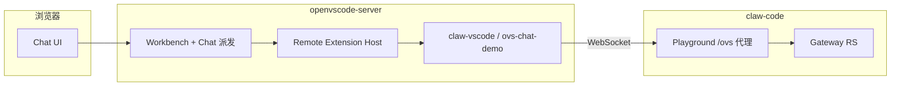

# OVS × claw-code 协作与扩展安装手册

Author: kejiqing  
适用版本：openvscode-server **v1.109.5**（分支 `ovs-chat-fix`）

---

## 1. 两个系统各管什么

| 仓库 | 职责 | 交付物 |
|------|------|--------|
| **openvscode-server** | IDE 运行时：源码补丁、OVS 编译/镜像、Machine 设置、Chat 派发链验证 | 自编译 `openvscode-server` 二进制/镜像、`scripts/ovs-chat/*` |
| **claw-code** | 业务栈：Gateway、Playground 代理、**真实 Chat 扩展** `claw-vscode`、compose 部署 | `extensions/claw-vscode/`、`deploy/stack/*`、`/ovs` 路由 |

**分工原则**

- **OVS 仓**：保证「浏览器 Chat → Remote Extension Host → participant handler」这条路通；用 `ovs-chat-demo` 做最小探针，**不含业务逻辑**。
- **claw-code 仓**：开发/迭代业务扩展；通过 VSIX 装进 OVS；扩展内连 Gateway WebSocket（`claw.agentWsBase`），不直接改 VS Code 源码。



---

## 2. 推荐接入顺序

### 阶段 A — 通路验证（当前）

1. OVS 仓编译并跑通：`bash scripts/ovs-chat/run-dev.sh`（默认 3100）
2. Chat 里 `@demo ping` → 看到 **demo ok**（Ask 或 Agent 模式均可，demo v0.2.3+）
3. 确认日志链：`[OVS-CHAT]`（浏览器 Console）+ Output **OVS Chat Demo**

### 阶段 B — 接入业务扩展

1. 在 **claw-code** 完善 `extensions/claw-vscode`（参考 demo 的 stub LM + participant 结构）
2. 打包 VSIX，安装到 OVS（见下文命令）
3. 启动 Gateway + Playground，配置 `claw.agentWsBase`（如 `ws://127.0.0.1:18765/ovs/agent/ws`）
4. Chat `@claw ...` 走 Gateway；**demo 扩展可卸载或共存**

### 阶段 C — 生产部署

1. `passionke/openvscode-releases` 打出 Linux OVS 镜像
2. claw-code `deploy/stack/Containerfile.openvscode` 换自建镜像 tag
3. compose 启动：`openvscode-server` + gateway；扩展在镜像构建时或 entrypoint 运行时安装

---

## 3. 业务扩展开发约束（claw-code 侧）

新插件建议对齐 `ovs-chat-demo` / `claw-vscode` 模板：

| 项 | 要求 |
|----|------|
| `extensionKind` | `["workspace"]`（必须跑在 **Remote EH**，不是 Browser Worker） |
| `main` | CommonJS `extension.js`（`require("vscode")`） |
| `enabledApiProposals` | `defaultChatParticipant`、`chatProvider` |
| `languageModelChatProviders` | 必须注册 stub LM（无 Copilot 时否则 `Language model unavailable`） |
| `chatParticipants[].modes` | 至少 `["ask","agent","edit"]`，避免默认 Agent 模式静默失败 |
| 启动参数 | `--enable-proposed-api=<publisher>.<extension-name>` |

**claw-vscode 扩展 ID**：`claw.claw-vscode`（publisher `claw`，name `claw-vscode`）  
**demo 扩展 ID**：`claw.ovs-chat-demo`

---

## 4. 打包 VSIX

在 **openvscode-server** 仓（或任意有 `package-ovs-extension-vsix.sh` 的环境）：

```bash
# 默认：打包仓内 extensions/ovs-chat-demo
bash scripts/ovs-chat/package-ovs-extension-vsix.sh
# → .build/ovs-chat-demo.vsix

# 打包 claw-code 业务扩展
bash scripts/ovs-chat/package-ovs-extension-vsix.sh \
  /path/to/claw-code/extensions/claw-vscode \
  /path/to/claw-code/.build/claw-vscode.vsix
```

无需 npm/node，脚本用 zip 组装 VSIX。

---

## 5. 安装扩展（核心命令）

### 5.1 变量约定

```bash
OVS_BIN="/path/to/vscode-reh-web-*/bin/openvscode-server"   # 或容器内路径
EXT_DIR="/opt/claw-extensions"      # 扩展安装目录（需可写）
SD="/opt/claw-ovs/server-data"      # server-data（含 Machine/settings.json）
VSIX="/path/to/your-extension.vsix"
EXT_ID="claw.claw-vscode"           # 如 claw.ovs-chat-demo
```

### 5.2 离线安装（服务未启动 / 容器构建时）

```bash
HOME="${HOME:-/tmp/ovs-home}" mkdir -p "$HOME"

"${OVS_BIN}" \
  --install-extension "${VSIX}" \
  --extensions-dir="${EXT_DIR}" \
  --server-data-dir="${SD}" \
  --force
```

### 5.3 运行时热更新（服务已启动）

**同一 `extensions-dir` + `server-data-dir` 再执行一次 install 即可**（会触发 Extension Host 重载）：

```bash
"${OVS_BIN}" \
  --install-extension "${VSIX}" \
  --extensions-dir="${EXT_DIR}" \
  --server-data-dir="${SD}" \
  --force
```

容器内示例：

```bash
podman cp claw-vscode.vsix ovs-chat-demo:/tmp/
podman exec ovs-chat-demo /home/.openvscode-server/bin/openvscode-server \
  --install-extension /tmp/claw-vscode.vsix \
  --extensions-dir=/opt/claw-extensions \
  --server-data-dir=/opt/claw-ovs/server-data \
  --force
```

### 5.4 列出 / 卸载

```bash
# 已安装扩展
"${OVS_BIN}" --list-extensions \
  --extensions-dir="${EXT_DIR}" \
  --server-data-dir="${SD}"

# 卸载
"${OVS_BIN}" --uninstall-extension "${EXT_ID}" \
  --extensions-dir="${EXT_DIR}" \
  --server-data-dir="${SD}"
```

### 5.5 UI 安装

Extensions 视图 → **从 VSIX 安装…**（marketplace 关闭时只能用 VSIX）。

---

## 6. 启动 OVS（必须带 proposed API）

扩展用了 proposal API，**必须在进程启动参数里声明**（不能只靠装 VSIX）：

```bash
exec "${OVS_BIN}" \
  --host=0.0.0.0 \
  --port=3000 \
  --without-connection-token \
  --extensions-dir="${EXT_DIR}" \
  --server-data-dir="${SD}" \
  --enable-proposed-api=claw.ovs-chat-demo,claw.claw-vscode \
  /home/workspace
```

多个扩展用逗号分隔。换扩展后需**重启 OVS 进程**才能新增 proposed API 名。

---

## 7. Machine 设置（两仓应对齐）

路径：

- 开发：`openvscode-server/scripts/ovs-chat/openvscode-settings.json` → 复制到 `${SD}/Machine/settings.json`
- 部署：`claw-code/deploy/stack/openvscode-settings.json`

**1.109.5 已验证组合**（以 OVS 仓为准）：

```json
{
  "chat.disableAIFeatures": true,
  "chat.agent.enabled": false,
  "chat.experimental.serverlessWebEnabled": false,
  "security.workspace.trust.enabled": false
}
```

注意：`chat.experimental.disableCoreAgents` 在 1.109.5 **无效**；用 `chat.disableAIFeatures`。

---

## 8. 本地一条龙命令

### 8.1 仅 demo（OVS 仓）

```bash
# 首次
bash scripts/ovs-chat/build-ovs.sh
# 每次开发
bash scripts/ovs-chat/run-dev.sh          # http://127.0.0.1:3100/
```

`run-dev.sh` 会自动：打包 demo VSIX → install → 带 `--enable-proposed-api=claw.ovs-chat-demo` 启动。

### 8.2 demo + claw-vscode（跨仓）

```bash
# 1. 编译 OVS（若尚未）
bash /path/to/openvscode-server/scripts/ovs-chat/build-ovs.sh

# 2. 打包业务扩展
bash /path/to/openvscode-server/scripts/ovs-chat/package-ovs-extension-vsix.sh \
  /path/to/claw-code/extensions/claw-vscode \
  /path/to/openvscode-server/.build/claw-vscode.vsix

# 3. 安装并启动（可改 run-dev.sh 或手动）
OVS_BIN="$(dirname /path/to/openvscode-server)/vscode-reh-web-darwin-arm64/bin/openvscode-server"
EXT_DIR="/path/to/openvscode-server/.build/ovs-extensions"
SD="/path/to/openvscode-server/.build/ovs-server-data"

"${OVS_BIN}" --install-extension /path/to/openvscode-server/.build/claw-vscode.vsix \
  --extensions-dir="${EXT_DIR}" --server-data-dir="${SD}" --force

exec "${OVS_BIN}" --host=127.0.0.1 --port=3100 --without-connection-token \
  --extensions-dir="${EXT_DIR}" --server-data-dir="${SD}" \
  --enable-proposed-api=claw.ovs-chat-demo,claw.claw-vscode \
  /path/to/openvscode-server/.build/ovs-workspace
```

### 8.3 Podman 本地验证

```bash
cd openvscode-server/scripts/ovs-chat
bash ../ovs-chat/package-ovs-extension-vsix.sh   # 生成 .build/ovs-chat-demo.vsix
podman compose build && podman compose up -d     # → http://127.0.0.1:13001/
```

---

## 9. 验证清单

| 检查 | 命令 / 操作 |
|------|-------------|
| 扩展已装 | `--list-extensions` 含 `claw.xxx` |
| HTTP | `curl -s -o /dev/null -w '%{http_code}' http://127.0.0.1:3100/` → `200` |
| Chat 回复 | `@demo ping` 或 `@claw ping` → 有文本回复 |
| 扩展日志 | Output → **OVS Chat Demo** / **Claw** |
| 派发链 | 浏览器 Console 过滤 `OVS-CHAT` |
| Remote EH | `tail -f .build/ovs-server-data/data/logs/*/exthost*/remoteexthost.log` |

---

## 10. 常见问题

| 现象 | 原因 | 处理 |
|------|------|------|
| 输入无反应 / `Cannot handle request` | 默认 **Agent** 模式，participant 未声明 `agent` | 切 **Ask**，或扩展 `modes` 加 `agent` |
| `Language model unavailable` | 无 Copilot 且无 stub LM | 扩展内 `registerLanguageModelChatProvider` + `package.json` 声明 vendor |
| `UNKNOWN vendor` | LM vendor 未在 `languageModelChatProviders` 声明 | 对齐 `package.json` 与代码 |
| proposed API 不生效 | 启动未带 `--enable-proposed-api` | 写入 CMD/compose，**重启进程** |
| 扩展装上了但不激活 | 未开 workspace / EH 未连上 | 打开文件夹；看 Remote 状态栏 |

---

## 11. 仓库索引

| 路径 | 说明 |
|------|------|
| `openvscode-server/extensions/ovs-chat-demo/` | 探针扩展 |
| `openvscode-server/scripts/ovs-chat/package-ovs-extension-vsix.sh` | 通用 VSIX 打包 |
| `openvscode-server/scripts/ovs-chat/run-dev.sh` | 本地 demo 开发 |
| `openvscode-server/scripts/ovs-chat/Containerfile.openvscode` | OVS 镜像 |
| `claw-code/extensions/claw-vscode/` | 业务 Chat 扩展 |
| `claw-code/deploy/stack/` | 生产 compose / 镜像 |
| `claw-code/docs/ovs-chat-source-handoff.md` | 历史交接（部分设置已过时，以本文 §7 为准） |

---

**维护**：claw-code 发布新扩展版本后，只需重新 `package` → `install-extension` →（若扩展 ID 变了）更新 `--enable-proposed-api` 并重启 OVS。
